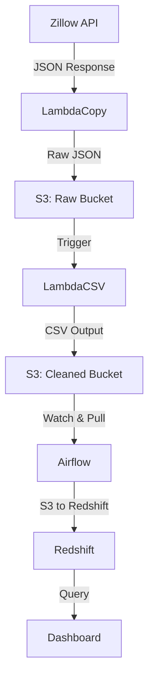

# 🏡 Zillow Real Estate Data Pipeline

Real estate data pipeline using Apache Airflow, AWS Lambda, Amazon S3, and Amazon Redshift. It includes automatic ingestion and transformation of Zillow data, and a Redshift-backed warehouse for advanced queries.

---

## 🖼️ Gallery – Quick Preview

**Dashboard**  


**Airflow DAG**  


**S3 Buckets Overview**  


**Raw JSON Copy Lambda**  


**Instance Details**  


**Redshift Query Editor**  


**CSV Conversion Lambda**  


---

## 🛠️ Project Overview

This project fetches real estate data from **Zillow API**, transforms it using AWS Lambda, and loads it into Amazon Redshift for analysis. The system is orchestrated with Apache Airflow and utilizes S3 for data staging.

---
## 📊 Data Analysis

### Exploratory Data Analysis (EDA)

- **Descriptive Statistics**: Summarized distributions of price, living area, bedrooms, and bathrooms.  
- **Visualizations**:  
  - Histogram of home prices (revealed strong right skew).  
  - Scatter plot of living area vs. price (positive correlation with outliers).  
  - Count plots of hometype distribution across zipcodes.  
  - Heatmap of correlations among numerical variables.  
- **Key Insight**: Price varies widely across locations, and living area shows strong predictive power.  

---

### Statistical Analysis

#### 1. T-Test (Condo vs. Single Family)  
- **Result**: Could not be performed since dataset lacked Single Family homes.  
- **Implication**: Indicates data imbalance; future studies should include diverse hometypes.  

#### 2. ANOVA (Price Differences by Zip Code)  
- **Result**: Significant difference found across zipcodes *(F = 9.21, p < 0.001)*.  
- **Post-hoc Tukey Test**:  
  - **90402 > 90403, 90404** (significantly higher).  
  - **90403 ≈ 90404** (no significant difference).  
- **Implication**: Location strongly drives price differences; 90402 is a premium market.  

#### 3. Chi-Square Test (Hometype vs. Zip Code)  
- **Result**: Strong association *(χ² = 38.07, p < 0.001)*.  
- **Observation**:  
  - **90402** → exclusively Single Family.  
  - **90403** → dominated by Condos.  
  - **90404** → more diverse with many Multi-Family units.  
- **Implication**: Housing stock distribution differs by neighborhood, likely due to zoning and demand.  

---

### 🔑 Overall Insights
- **Location matters**: 90402 is the most expensive zipcode.  
- **Hometype is location-dependent**: Some areas are condo-heavy, while others are single-family dominated.  
- **Data limitation**: Lack of balanced hometype data reduces comparability.  

---

## 🧰 Tech Stack

- **Zillow API via RapidAPI** – Source listings
- **AWS Lambda** – Transformation and copying
- **Amazon S3** – Data staging and storage
- **Apache Airflow** – Pipeline orchestration
- **Amazon Redshift** – Data warehouse

---

## 📡 Architecture



---

## 🚀 Setup Guide

### 1. Clone the Repository

```bash
git clone https://github.com/Tanya0139/aws-api-to-redshift.git
cd aws-api-to-redshift
```

### 2. Set Up Python & Airflow

```bash
sudo apt update
sudo apt install python3-pip
sudo apt install python3.10-venv
python3 -m venv endtoendyoutube_venv
source endtoendyoutube_venv/bin/activate
pip install --upgrade awscli
pip install apache-airflow
airflow standalone
pip install apache-airflow-providers-amazon
```

### 3. Configure AWS CLI

```bash
aws configure
```

---

## ⚙️ Lambda Functions

**1. `copyRawJsonFile-lambdaFunction.py`**

```python
import boto3
import json

s3_client = boto3.client('s3')

def lambda_handler(event, context):
    source_bucket = event['Records'][0]['s3']['bucket']['name']
    object_key = event['Records'][0]['s3']['object']['key']
    target_bucket = 'copy-of-raw-json-bucket-tan'
    copy_source = {'Bucket': source_bucket, 'Key': object_key}
    waiter = s3_client.get_waiter('object_exists')
    waiter.wait(Bucket=source_bucket, Key=object_key)
    s3_client.copy_object(Bucket=target_bucket, Key=object_key, CopySource=copy_source)
    return {
        'statusCode': 200,
        'body': json.dumps('Copy completed successfully')
    }
```

**2. `transformation-convert-to-csv-lambdaFunction.py`**

```python
import boto3
import json
import pandas as pd

s3_client = boto3.client('s3')

def lambda_handler(event, context):
    source_bucket = event['Records'][0]['s3']['bucket']['name']
    object_key = event['Records'][0]['s3']['object']['key']
    target_bucket = 'cleaned-data-zone-csv-bucket-tan'
    target_file_name = object_key[:-5]
    waiter = s3_client.get_waiter('object_exists')
    waiter.wait(Bucket=source_bucket, Key=object_key)
    response = s3_client.get_object(Bucket=source_bucket, Key=object_key)
    data = response['Body'].read().decode('utf-8')
    data = json.loads(data)
    df = pd.DataFrame(data["results"])
    selected_columns = ['bathrooms', 'bedrooms', 'city', 'homeStatus', 
                        'homeType','livingArea','price', 'rentZestimate','zipcode']
    df = df[selected_columns]
    csv_data = df.to_csv(index=False)
    s3_client.put_object(Bucket=target_bucket, Key=f"{target_file_name}.csv", Body=csv_data)
    return {
        'statusCode': 200,
        'body': json.dumps('CSV conversion and S3 upload completed successfully')
    }
```

---

## ⛅ Airflow DAG Sample – `zillowanalytics.py`

```python
# abbreviated for clarity
```

---

## 📦 Buckets Used

| Bucket Name                         | Purpose                         |
|------------------------------------|----------------------------------|
| `endtoendyt-ym-bucket`             | Raw JSON from Zillow API         |
| `copy-of-raw-json-bucket-tan`      | Backup of raw JSON               |
| `cleaned-data-zone-csv-bucket-tan` | Transformed CSV files            |

---

## 🧪 Query Example in Redshift

```sql
SELECT city, COUNT(*) AS listings_count, AVG(price) as avg_price
FROM zillowdata
GROUP BY city
ORDER BY avg_price DESC;
```

---
